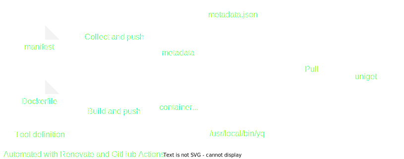

# Concepts

`uniget` packages tools into dedicated container images used to transport tools to your system. These images are created `FROM scratch` and contain only one tool without dependencies.

When tools are installed, the container image is pulled from the registry and the tool is extracted into the target directory. Running a tool will not rely on containerization technology but run the binary without isolation.

The CLI is a statically linked Go binary and is used to discover, install and update tools.

Tools are defined by...

`manifest.yaml` contains metadata about the tool

`Dockerfile` packages the tool into a container image

Every tool is stored in a dedicated container image

`metadata` contains JSON of all `manifest.yaml`

Renovate keeps tool versions up-to-date

Changes are automatically tested and merged